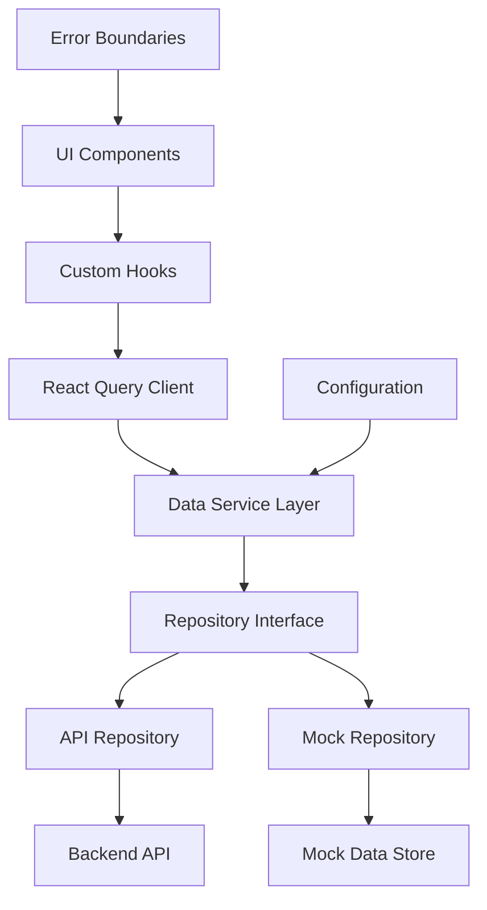

# Design Document

## Overview

Данный документ описывает архитектурные улучшения для проекта Learn&Share, направленные на создание масштабируемой, тестируемой и гибкой системы управления данными. Основные принципы дизайна:

- **Separation of Concerns** - четкое разделение слоев приложения
- **Dependency Injection** - возможность подмены реализаций
- **Single Source of Truth** - централизованное управление состоянием
- **Developer Experience** - удобство разработки и отладки

## Architecture

### High-Level Architecture



### Layer Responsibilities

1. **UI Layer** - Презентационные компоненты, только отображение
2. **Hooks Layer** - Бизнес-логика, состояние компонентов
3. **Query Layer** - Кеширование, синхронизация, оптимизация запросов
4. **Service Layer** - Координация между источниками данных
5. **Repository Layer** - Абстракция источников данных
6. **Data Layer** - Конкретные реализации (API, Mock)

## Components and Interfaces

### 1. Configuration System

```typescript
// src/config/index.ts
interface AppConfig {
  api: {
    baseUrl: string;
    timeout: number;
  };
  features: {
    useMockData: boolean;
    enableDevTools: boolean;
  };
  app: {
    name: string;
    version: string;
  };
}

// Валидация конфигурации с Zod
const configSchema = z.object({
  api: z.object({
    baseUrl: z.string().url(),
    timeout: z.number().positive(),
  }),
  features: z.object({
    useMockData: z.boolean(),
    enableDevTools: z.boolean(),
  }),
  app: z.object({
    name: z.string(),
    version: z.string(),
  }),
});
```

### 2. Repository Pattern

```typescript
// src/repositories/interfaces.ts
interface UserRepository {
  getProfile(id?: string): Promise<UserProfile>;
  updateProfile(data: UpdateProfileData): Promise<void>;
  login(credentials: LoginData): Promise<LoginResponse>;
}

interface TeacherRepository {
  getTeachers(filters?: TeacherFilters): Promise<TeacherProfile[]>;
  getTeacher(id: string): Promise<TeacherProfile>;
  getTeacherLessons(): Promise<TeacherLesson[]>;
}

// src/repositories/api/UserApiRepository.ts
class UserApiRepository implements UserRepository {
  constructor(private apiClient: AxiosInstance) {}

  async getProfile(id?: string): Promise<UserProfile> {
    // API implementation
  }
}

// src/repositories/mock/UserMockRepository.ts
class UserMockRepository implements UserRepository {
  constructor(private mockStore: MockDataStore) {}

  async getProfile(id?: string): Promise<UserProfile> {
    // Mock implementation with realistic delays
    await delay(Math.random() * 1000 + 500);
    return (
      this.mockStore.users.find((u) => u.id === id) ||
      this.mockStore.currentUser
    );
  }
}
```

### 3. Data Service Layer

```typescript
// src/services/DataService.ts
class DataService {
  private userRepo: UserRepository;
  private teacherRepo: TeacherRepository;
  private lessonRepo: LessonRepository;

  constructor(
    private config: AppConfig,
    private apiClient?: AxiosInstance,
    private mockStore?: MockDataStore
  ) {
    this.initializeRepositories();
  }

  private initializeRepositories() {
    if (this.config.features.useMockData) {
      this.userRepo = new UserMockRepository(this.mockStore!);
      this.teacherRepo = new TeacherMockRepository(this.mockStore!);
      this.lessonRepo = new LessonMockRepository(this.mockStore!);
    } else {
      this.userRepo = new UserApiRepository(this.apiClient!);
      this.teacherRepo = new TeacherApiRepository(this.apiClient!);
      this.lessonRepo = new LessonApiRepository(this.apiClient!);
    }
  }

  getUserRepository(): UserRepository {
    return this.userRepo;
  }

  getTeacherRepository(): TeacherRepository {
    return this.teacherRepo;
  }

  getLessonRepository(): LessonRepository {
    return this.lessonRepo;
  }
}
```

### 4. React Query Integration

```typescript
// src/hooks/queries/useUserProfile.ts
export function useUserProfile(id?: string) {
  const dataService = useDataService();

  return useQuery({
    queryKey: ["user", "profile", id],
    queryFn: () => dataService.getUserRepository().getProfile(id),
    staleTime: 5 * 60 * 1000, // 5 minutes
    cacheTime: 10 * 60 * 1000, // 10 minutes
    retry: (failureCount, error) => {
      if (error.status === 404) return false;
      return failureCount < 3;
    },
  });
}

// src/hooks/mutations/useUpdateProfile.ts
export function useUpdateProfile() {
  const dataService = useDataService();
  const queryClient = useQueryClient();

  return useMutation({
    mutationFn: (data: UpdateProfileData) =>
      dataService.getUserRepository().updateProfile(data),
    onSuccess: () => {
      queryClient.invalidateQueries(["user", "profile"]);
    },
  });
}
```

### 5. Mock Data System

```typescript
// src/mock/MockDataStore.ts
class MockDataStore {
  private data: {
    users: UserProfile[];
    teachers: TeacherProfile[];
    lessons: Lesson[];
    categories: Category[];
  };

  constructor() {
    this.data = this.generateInitialData();
  }

  private generateInitialData() {
    return {
      users: generateMockUsers(50),
      teachers: generateMockTeachers(20),
      lessons: generateMockLessons(100),
      categories: generateMockCategories(),
    };
  }

  // CRUD operations with persistence in sessionStorage
  updateUser(id: string, updates: Partial<UserProfile>) {
    const index = this.data.users.findIndex((u) => u.id === id);
    if (index !== -1) {
      this.data.users[index] = { ...this.data.users[index], ...updates };
      this.persist();
    }
  }

  private persist() {
    if (typeof window !== "undefined") {
      sessionStorage.setItem("mockData", JSON.stringify(this.data));
    }
  }

  private restore() {
    if (typeof window !== "undefined") {
      const stored = sessionStorage.getItem("mockData");
      if (stored) {
        this.data = JSON.parse(stored);
      }
    }
  }
}
```

### 6. Provider System

```typescript
// src/providers/DataServiceProvider.tsx
const DataServiceContext = createContext<DataService | null>(null);

export function DataServiceProvider({ children }: { children: ReactNode }) {
  const [dataService] = useState(() => {
    const config = getAppConfig();

    if (config.features.useMockData) {
      const mockStore = new MockDataStore();
      return new DataService(config, undefined, mockStore);
    } else {
      const apiClient = createApiClient(config);
      return new DataService(config, apiClient);
    }
  });

  return (
    <DataServiceContext.Provider value={dataService}>
      {children}
    </DataServiceContext.Provider>
  );
}

export function useDataService() {
  const context = useContext(DataServiceContext);
  if (!context) {
    throw new Error("useDataService must be used within DataServiceProvider");
  }
  return context;
}
```

## Data Models

### Enhanced Type System

```typescript
// src/types/api.ts - API specific types
export interface ApiResponse<T> {
  data: T;
  status: number;
  message?: string;
}

export interface PaginatedResponse<T> {
  data: T[];
  pagination: {
    page: number;
    limit: number;
    total: number;
    hasNext: boolean;
    hasPrev: boolean;
  };
}

// src/types/domain.ts - Domain models
export interface User {
  id: string;
  email: string;
  name: string;
  surname: string;
  avatar?: string;
  createdAt: Date;
  updatedAt: Date;
}

// src/types/queries.ts - Query related types
export interface QueryOptions {
  enabled?: boolean;
  staleTime?: number;
  cacheTime?: number;
  refetchOnWindowFocus?: boolean;
}

export interface MutationOptions<TData, TVariables> {
  onSuccess?: (data: TData, variables: TVariables) => void;
  onError?: (error: Error, variables: TVariables) => void;
}
```

## Error Handling

### Error Boundary System

```typescript
// src/components/ErrorBoundary/ErrorBoundary.tsx
interface ErrorBoundaryState {
  hasError: boolean;
  error?: Error;
  errorInfo?: ErrorInfo;
}

class ErrorBoundary extends Component<PropsWithChildren, ErrorBoundaryState> {
  constructor(props: PropsWithChildren) {
    super(props);
    this.state = { hasError: false };
  }

  static getDerivedStateFromError(error: Error): ErrorBoundaryState {
    return { hasError: true, error };
  }

  componentDidCatch(error: Error, errorInfo: ErrorInfo) {
    this.setState({ errorInfo });

    // Log error to monitoring service
    if (process.env.NODE_ENV === "production") {
      logErrorToService(error, errorInfo);
    }
  }

  render() {
    if (this.state.hasError) {
      return (
        <ErrorFallback
          error={this.state.error}
          resetError={() => this.setState({ hasError: false })}
        />
      );
    }

    return this.props.children;
  }
}

// src/components/ErrorBoundary/ErrorFallback.tsx
interface ErrorFallbackProps {
  error?: Error;
  resetError: () => void;
}

function ErrorFallback({ error, resetError }: ErrorFallbackProps) {
  return (
    <div className={styles.errorContainer}>
      <h2>Something went wrong</h2>
      <details>
        <summary>Error details</summary>
        <pre>{error?.message}</pre>
      </details>
      <Button onClick={resetError}>Try again</Button>
    </div>
  );
}
```

### Query Error Handling

```typescript
// src/hooks/queries/useQueryWithErrorHandling.ts
export function useQueryWithErrorHandling<T>(
  queryKey: QueryKey,
  queryFn: QueryFunction<T>,
  options?: UseQueryOptions<T>
) {
  const { showError } = useErrorNotification();

  return useQuery({
    queryKey,
    queryFn,
    ...options,
    onError: (error) => {
      if (error instanceof ApiError) {
        showError(error.userMessage || "Something went wrong");
      } else {
        showError("Network error occurred");
      }
      options?.onError?.(error);
    },
  });
}
```

## Testing Strategy

### Mock Provider for Tests

```typescript
// src/test-utils/MockDataServiceProvider.tsx
export function MockDataServiceProvider({
  children,
  initialData,
}: {
  children: ReactNode;
  initialData?: Partial<MockData>;
}) {
  const mockStore = useMemo(() => {
    const store = new MockDataStore();
    if (initialData) {
      store.setData(initialData);
    }
    return store;
  }, [initialData]);

  const dataService = useMemo(() => {
    const config = { ...getAppConfig(), features: { useMockData: true } };
    return new DataService(config, undefined, mockStore);
  }, [mockStore]);

  return (
    <DataServiceContext.Provider value={dataService}>
      <QueryClient client={createTestQueryClient()}>{children}</QueryClient>
    </DataServiceContext.Provider>
  );
}

// Usage in tests
test("should display user profile", async () => {
  const mockUser = { id: "1", name: "John", surname: "Doe" };

  render(
    <MockDataServiceProvider initialData={{ users: [mockUser] }}>
      <UserProfile userId="1" />
    </MockDataServiceProvider>
  );

  expect(await screen.findByText("John Doe")).toBeInTheDocument();
});
```

### Repository Testing

```typescript
// src/repositories/__tests__/UserRepository.test.ts
describe("UserRepository", () => {
  describe("API Implementation", () => {
    it("should fetch user profile from API", async () => {
      const mockApiClient = createMockApiClient();
      const repository = new UserApiRepository(mockApiClient);

      mockApiClient.get.mockResolvedValue({ data: mockUserProfile });

      const result = await repository.getProfile("1");

      expect(result).toEqual(mockUserProfile);
      expect(mockApiClient.get).toHaveBeenCalledWith("/api/users/1/profile");
    });
  });

  describe("Mock Implementation", () => {
    it("should fetch user profile from mock store", async () => {
      const mockStore = new MockDataStore();
      const repository = new UserMockRepository(mockStore);

      const result = await repository.getProfile("1");

      expect(result).toBeDefined();
      expect(result.id).toBe("1");
    });
  });
});
```

## Performance Considerations

### Query Optimization

1. **Stale-While-Revalidate** - показываем кешированные данные, обновляем в фоне
2. **Query Deduplication** - React Query автоматически дедуплицирует одинаковые запросы
3. **Background Refetching** - обновление данных при фокусе окна
4. **Optimistic Updates** - мгновенное обновление UI с откатом при ошибке

### Code Splitting

```typescript
// Lazy loading для больших компонентов
const AdminPanel = lazy(() => import("@/features/admin/AdminPanel"));
const TeacherDashboard = lazy(() => import("@/features/teacher/Dashboard"));

// Предзагрузка критических данных
export function prefetchUserData(queryClient: QueryClient, userId: string) {
  return queryClient.prefetchQuery({
    queryKey: ["user", "profile", userId],
    queryFn: () => dataService.getUserRepository().getProfile(userId),
  });
}
```

### Memory Management

```typescript
// Автоматическая очистка кеша для неиспользуемых данных
const queryClient = new QueryClient({
  defaultOptions: {
    queries: {
      cacheTime: 10 * 60 * 1000, // 10 minutes
      staleTime: 5 * 60 * 1000, // 5 minutes
      refetchOnWindowFocus: false,
    },
  },
});
```

## Development Tools

### Mock Data Indicator

```typescript
// src/components/DevTools/MockDataIndicator.tsx
export function MockDataIndicator() {
  const config = useAppConfig();

  if (!config.features.useMockData || process.env.NODE_ENV === "production") {
    return null;
  }

  return (
    <div className={styles.mockIndicator}>
      <span>🔧 Using Mock Data</span>
    </div>
  );
}
```

### Query DevTools Integration

```typescript
// src/providers/QueryProvider.tsx
export function QueryProvider({ children }: { children: ReactNode }) {
  const config = useAppConfig();

  return (
    <QueryClientProvider client={queryClient}>
      {children}
      {config.features.enableDevTools && (
        <ReactQueryDevtools initialIsOpen={false} />
      )}
    </QueryClientProvider>
  );
}
```

## Migration Strategy

### Phase 1: Foundation

1. Установка React Query и настройка базовой конфигурации
2. Создание системы конфигурации и валидации
3. Реализация базовых Error Boundaries

### Phase 2: Data Layer

1. Создание интерфейсов репозиториев
2. Реализация API репозиториев (рефакторинг существующего ApiService)
3. Создание системы Mock данных

### Phase 3: Integration

1. Создание DataService и провайдеров
2. Миграция существующих хуков на React Query
3. Обновление компонентов для использования новых хуков

### Phase 4: Enhancement

1. Добавление оптимизаций производительности
2. Расширение системы тестирования
3. Добавление дополнительных dev tools

Данная архитектура обеспечивает:

- **Гибкость** - легкое переключение между источниками данных
- **Тестируемость** - изолированное тестирование каждого слоя
- **Производительность** - эффективное кеширование и оптимизация запросов
- **Developer Experience** - удобные инструменты разработки и отладки
- **Масштабируемость** - четкое разделение ответственности между слоями
